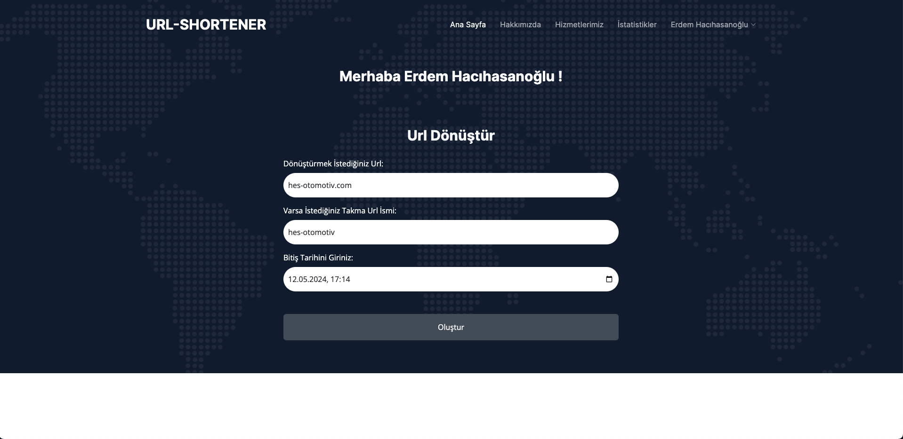

#URL SHORTENER

## ÇALIŞMA AMACI
Proje kapsamında verilen URL'yi (Uniform Resource Locator, link) daha kısa ve tahmin edilemez bir format dönüştüren sistemin gerçekleştirilmesi beklenmektedir.  Mimaride kısaltılacak linkin yanı sıra; URL'nin geçerlilik tarihi, tıklanma sayısı ve URL'yi oluşturan kişi bilgileri de tutulacaktır.

## OBJECTIVE
It is expected that a system that transforms the URL (Uniform Resource Locator, link) given within the scope of the project into a shorter and unpredictable format will be implemented. In addition to the link to be shortened in architecture; The validity date of the URL, the number of clicks and the person who created the URL will also be kept.

### ÇALIŞTIRMA AŞAMALARI
 
 Bir terminal açılıp aşağıdaki aşamalar sırasıyla gerçekleştirilmelidir;
 
- ````
  npm i
  ````
 
- ````
  npm start
  ````